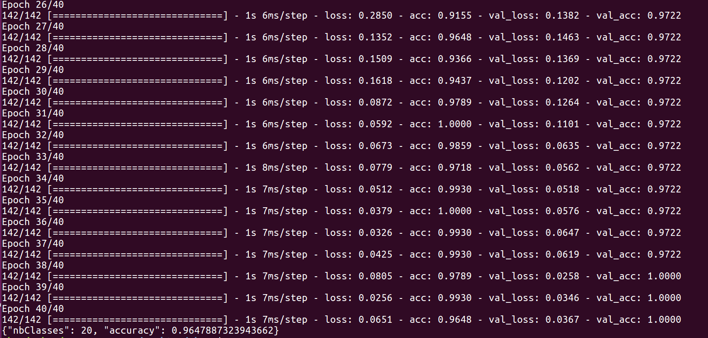
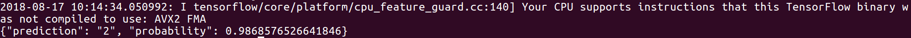
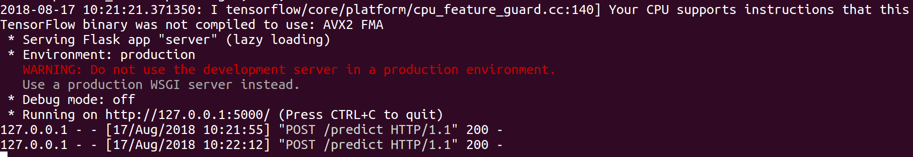
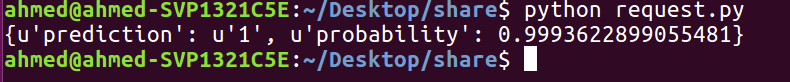

# Keras-REST-API-TensorFlow-backend-
Building a simple Keras CNN model and serve it using Keras REST API using Flask

# Getting started
I propose a simple method to serve your Keras model using python where Keras is using Tensorflow backend.

# Training
You have to install Keras and opencv

```
pip install keras
pip install opencv-python
```
To run the script 
```
python cnn_train.py "OWNER" "ID_NEURAL_convnet" "TRAIN_DIR"
```
You can type any example you want for "OWNER" & "ID_NEURAL_convnet" <br />
"TRAIN_DIR" = faces_train


# Testing 
To run the script 
```
python cnn_test.py "OWNER" "ID_NEURAL_convnet" "TEST_DIR" "NB_CLASSES"
```
"TEST_DIR" = faces_test <br />
"NB_CLASSES" = number of classes in your database, for example in this case = 20


# Serving
To run the server
```
python server.py
```


# Request
To make a request
```
python request.py
```

